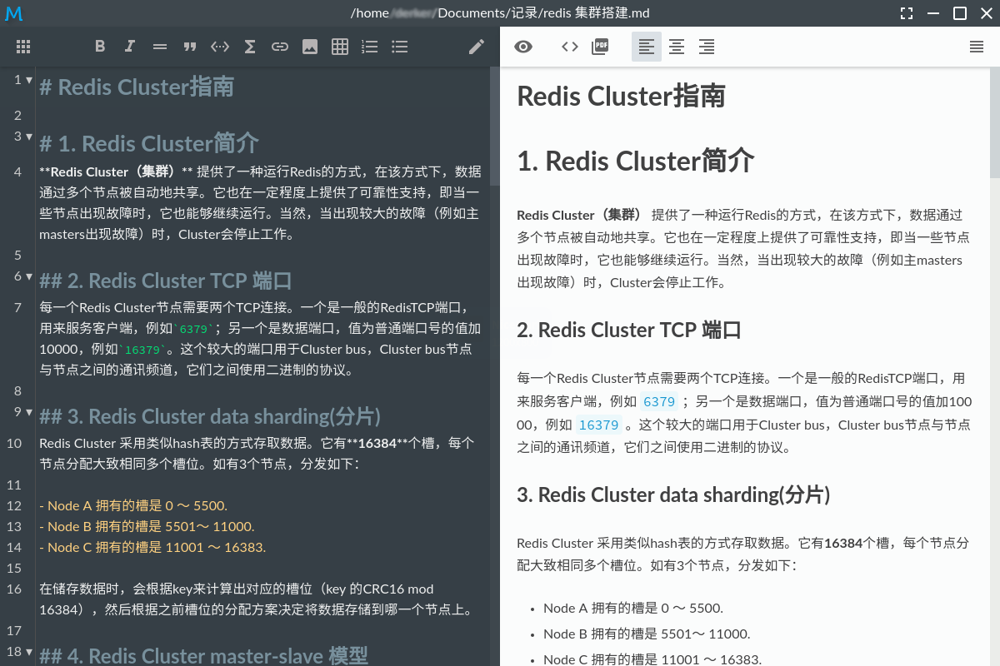
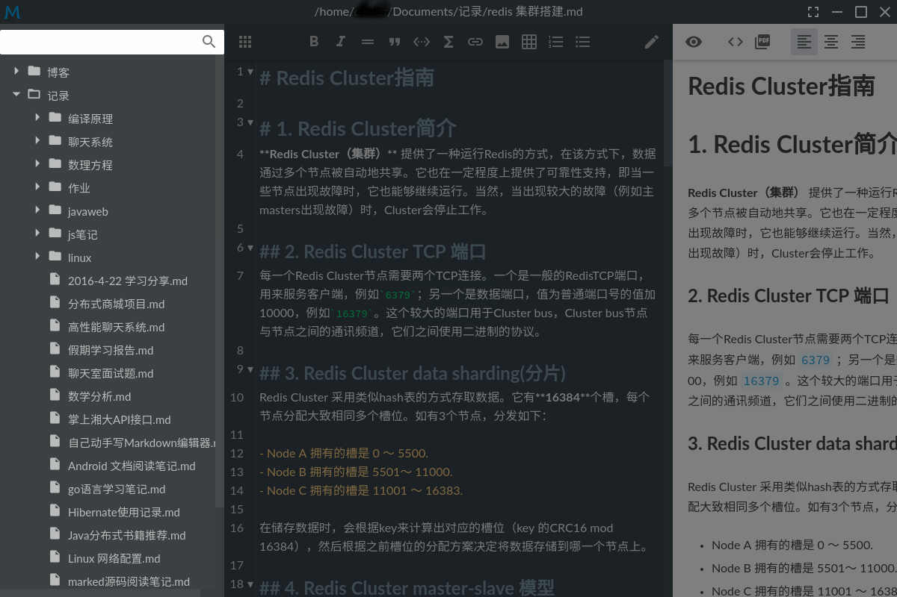
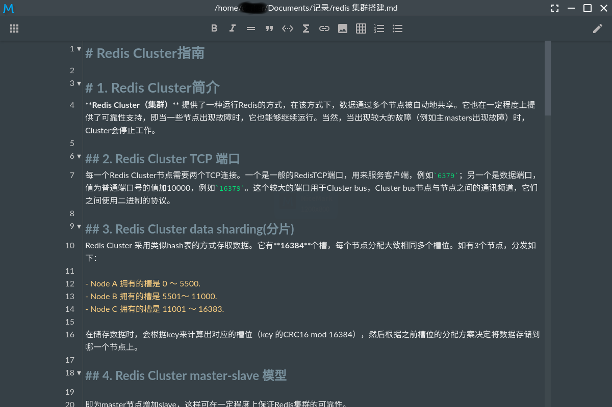
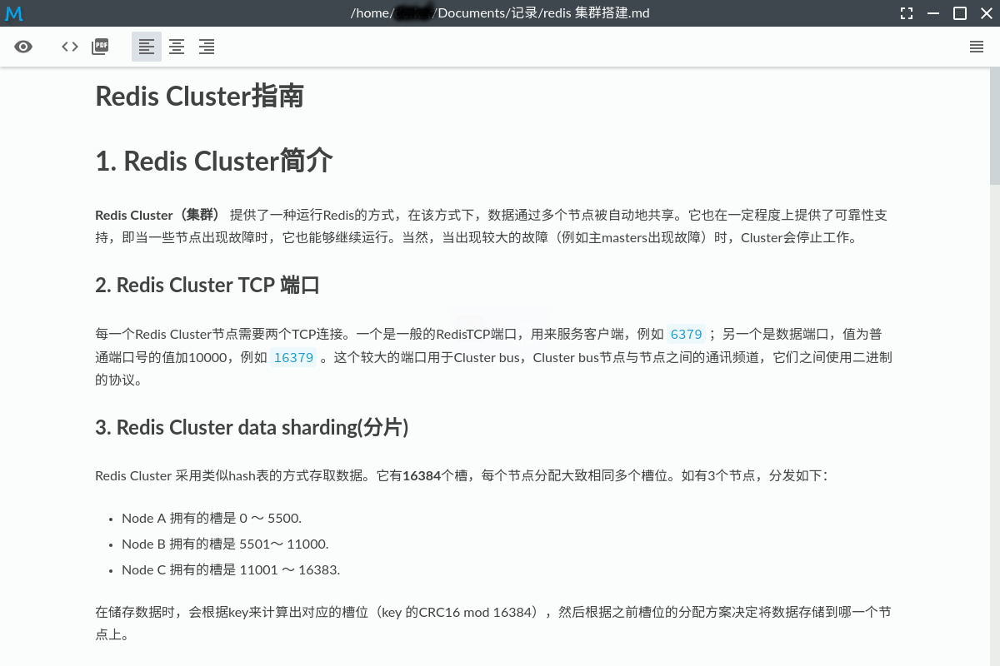
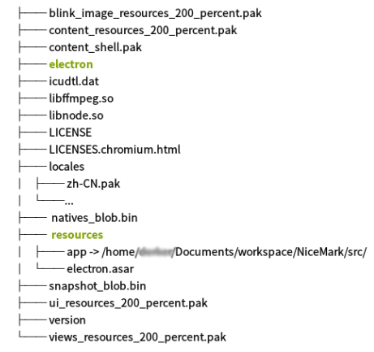

# NiceMark

## 1. 简介

NiceMark是一款基于!electron(https://github.com/electron/electron)的markdown编辑器。它外观简洁，使用简单，欢迎使用。

下面是软件的截图：

## 2. 安装

第一步：在[electron官网](http://electron.atom.io/)下载相应平台下的electron压缩包，也可以在这个[镜像站](https://npm.taobao.org/mirrors/electron)下载，解压；

第二步：在解压后的文件中找到`resources`文件夹，删除里面的`default_app.asar`文件；将源码的`src`目录重命名为`app`，拷贝到`resources`文件夹中；

第三步：运行electron(.exe)文件。

目录结构如下图：

